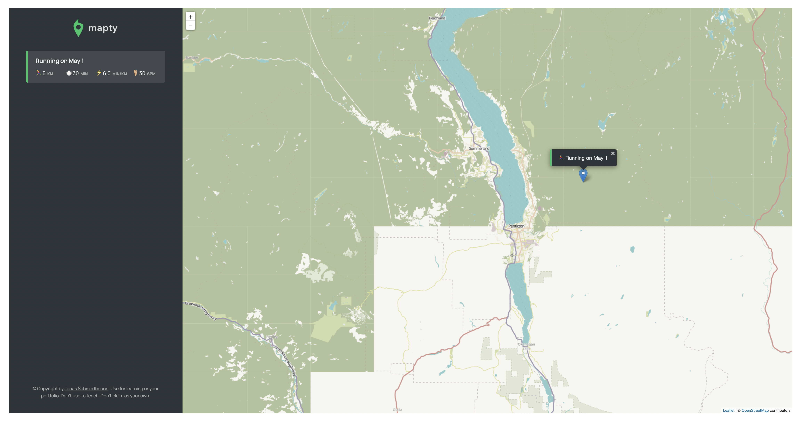

# [Mapty App: Track and Visualize Your Workouts 🌍📍](https://uche-jordy-mapty.netlify.app/)

## Introduction
[Mapty](https://uche-jordy-mapty.netlify.app/) is an innovative application designed for fitness enthusiasts to plan, record, and visualize their running and cycling trails. Utilizing the Leaflet map API, Mapty offers an interactive experience to track workouts across various locations for future reference.

## Key Features 🚵
- **Exercise Logging**: Choose between running or cycling and log details such as distance, duration, cadence (for running), and elevation gain (for cycling).
- **Interactive Map Display**: Workouts are marked on the map with clickable labels, offering an engaging way to review your fitness journey.
- **Dynamic Dashboard**: Real-time dashboard updates to display your workout data, enhancing tracking and analysis.
- **Local Storage Integration**: Securely stores your workout data using the local storage API for later access.

## User Interaction
- **Easy Data Entry**: Simply click on the map to bring up the dynamic form and enter your workout details.
- **Map Navigation**: Click on any workout in the dashboard to center the map on its marker. Double-click a marker for zoomed-in location details.

## How to Get Started
1. Clone the repository: `git clone https://github.com/UniLife-Projects/Mapty-APP.git`
2. Open `index.html` in your browser to launch Mapty.

## Sneak Peek

## Join the Mapty Community
Start tracking and visualizing your fitness journey today with Mapty!

---
